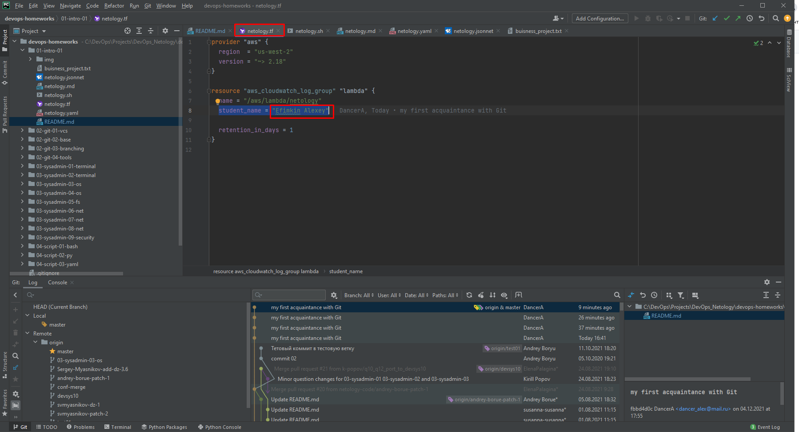
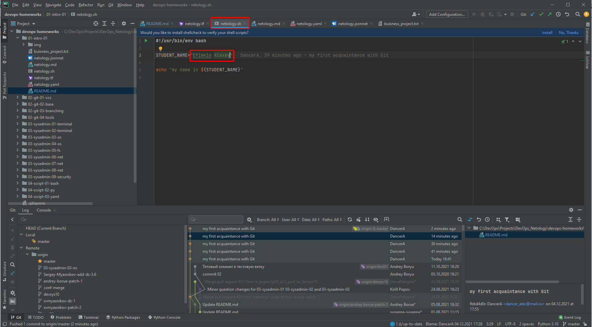
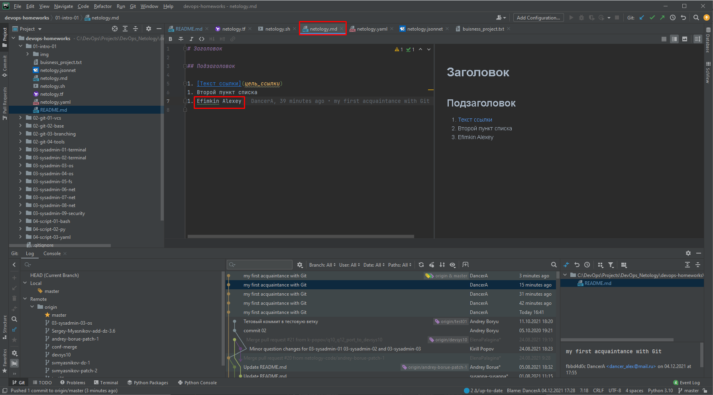
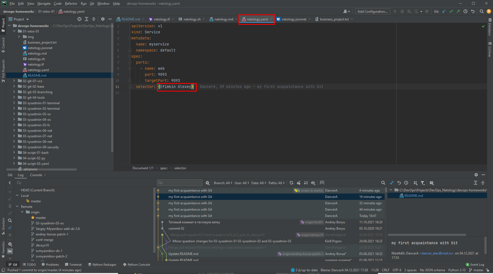
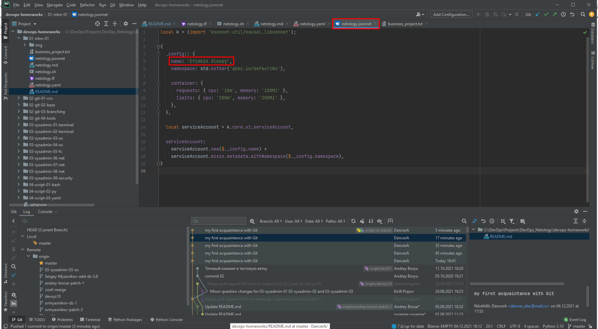

# ДЗ «1.1. Введение в DevOps»

## Задание №1 - Подготовка рабочей среды

1. Файлы для проверки плагинов:
    - [netology.tf](netology.tf) – terraform,
      
    - [netology.sh](netology.sh) – bash,
      
    - [netology.md](netology.md) – markdown,
      
    - [netology.yaml](netology.yaml) – yaml,
      
    - [netology.jsonnet](netology.jsonnet) – jsonnet.
      

## Задание №2 - Описание жизненного цикла задачи (разработки нового функционала)

- [Бизнесс процесс](buisness_project.txt)